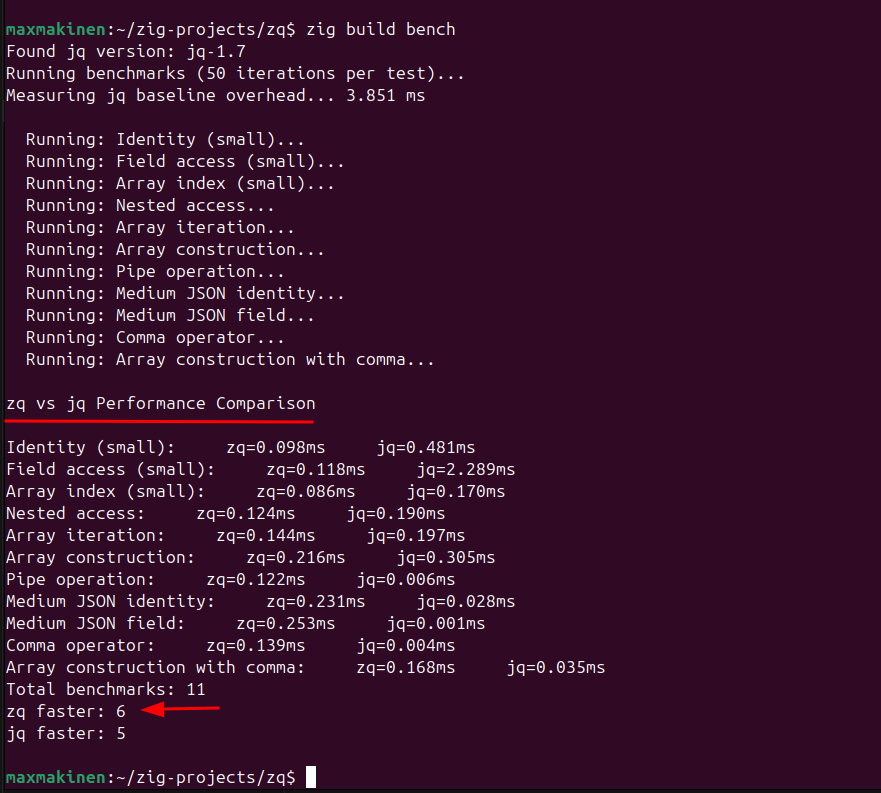

# zq

A lightweight JSON processor in Zig - a clone of jq.

zq is very minimal and follows the instructions/steps at 
https://codingchallenges.fyi/challenges/challenge-jq

Nothing more, nothing less.

Real jq is much more feature rich and zq does not even come close to what jq provides.
This is a purely educational exercise in learning Zig language.

## Build

```bash
zig build
```

Build in release mode for maximum performance:

```bash
zig build -Doptimize=ReleaseFast
```

## Run

Run with default identity filter:

```bash
./zig-out/bin/zq < input.json
```

Run with a filter:

```bash
./zig-out/bin/zq '.field' input.json
```

Or via build system:

```bash
zig build run -- '.field' input.json
```

## Test

Run all tests:

```bash
zig build test --summary all
```

## Benchmark

Compare performance against jq:

```bash
zig build bench
```

### Performance Comparison



**Results**: zq outperforms jq in some benchmarks.

## Requirements

- Zig 0.15.2
- jq (for benchmarking only)
